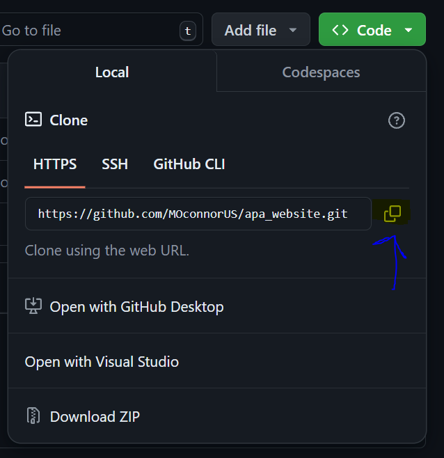

# APA Website

# Getting Started
## The following are needed in order to download and run this project
1. Git installed

Once you have everything installed, follow the guide below to download and run the project
---

# Installing Git
To install Git visit this [link](https://git-scm.com/downloads) and install the latest version of Git.
---

# How to clone/download the repository
1. Open Command prompt by typing `cmd` into the search bar on your windows device
2. Open your file explorer and navigate to `Local Disk (C:)` then `Users` and finally the folder labeled with your username
3. Navigate to the folder mentioned above that you wish to clone the repository in which can be done by typing `cd file_path_to_directory` into the command prompt 
3. Click on the green code button on the repository

4. Copy the github link provided in the drop down

5. Type: git clone github_link *github_link is the url provided by github which can be pasted by right clicking on the command prompt*
---

# How to run the project
1. Open your file folder to the correct destination as assigned in the download/cloning step.
2. Open apa_website and then the pages folder.
3. Double click any .html file in the pages folder to open the webpage in your browser.
